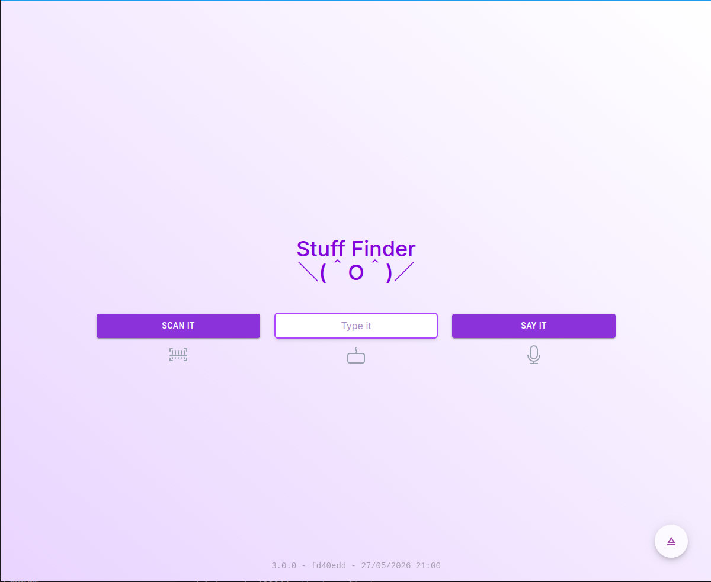

# Stuff Finder

## Demo

 [https://stuff-finder.netlify.app](https://stuff-finder.netlify.app)

## Build sizes

- 0.1.1 : 4KB html + 9KB css + 320KB js
- 0.1.0 : 3KB html + 9KB css + 435KB js
- 0.2.0 : 8KB html + 20KB css + 305KB js
- 0.4.0 : 12KB html + 22KB css + 320KB js
- 0.5.0 : 12KB html + 22KB css + 330KB js
- 1.0.0 : 6KB html + 27KB css + 360KB js (migration to vite & preact with old code)
- 1.1.0 : 6KB html + 27KB css + 445KB js (added mui + mui icons)
- 1.2.0 : 3KB html + 26KB css + 622KB js (added notistack + preact-router)
- 1.3.0 : 3KB html + 16KB css + 683KB js
- 2.0.0 : 3KB html + 18KB css + 720KB js (more components, better design)
- 2.1.0 : 1KB html + 18KB css + 726KB js
- 2.2.0 : 1KB html + 18KB css + 691KB js (after making everything lazy & optimizing common deps)
- 3.0.0 : 2KB html + 28KB css + 1007KB js (after react migration and various features)
- 3.1.0 : 3KB html + 31KB css + 1020KB js (new design: AppPill, AppWave, AppLocSticker, AppButton)

Check build stats in details by running `pnpm build:analyze`. Tooling benchmarks are tracked in [docs/benchmarks.md](docs/benchmarks.md).

## Thanks

- [101 Soundboards](https://www.101soundboards.com/sounds/1295599-barcode-scan-beep-09) : for the various sounds used in the app
- [Boxy Svg](https://boxy-svg.com) : simple & effective svg editor
- [Oxlint](https://oxc.rs/docs/guide/usage/linter.html) : super fast linter to find & fix problems
- [Oxfmt](https://oxc.rs/docs/guide/usage/formatter.html) : super fast formatter
- [Eye icon](https://www.iconfinder.com/icons/5925640/eye_no_view_icon) by IconPai
- [Favicon.io](https://favicon.io/favicon-generator/?t=SF&ff=Istok+Web&fs=110&fc=%23FFF&b=rounded&bc=%23e04a2b) : handy favicon generator
- [Github](https://github.com) : this great, free and evolving platform
- [MUI](https://mui.com) : a nice material ui lib
- [Netlify](https://netlify.com) : awesome company that offers hosting for OSS
- [Pattern Monster](https://pattern.monster/doodle-21) : Various quality patterns for app bg
- [React](https://reactjs.org) : great library for web and native user interfaces
- [RIOT Optimizer](https://riot-optimizer.com) : Radical Image Optimization Tool, the best software I found to compress images
- [Shields.io](https://shields.io) : for the nice badges on top of this readme
- [Shuutils](https://github.com/Shuunen/shuutils) : collection of pure JS utils
- [Svg Omg](https://jakearchibald.github.io/svgomg/) : the great king of svg file size reduction
- [SvgOmg](https://jakearchibald.github.io/svgomg/) : great tool to reduce svg image size
- [TailwindCss](https://tailwindcss.com) : awesome lib to produce maintainable style
- [V8](https://github.com/demurgos/v8-coverage) : simple & effective cli for code coverage
- [Vite](https://github.com/vitejs/vite) : super fast frontend tooling
- [Vitest](https://github.com/vitest-dev/vitest) : super fast vite-native testing framework

## Stargazers over time

## Page views

