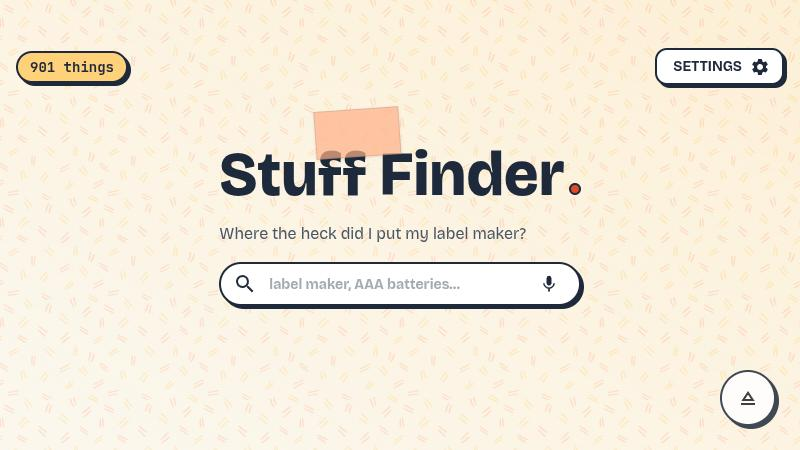
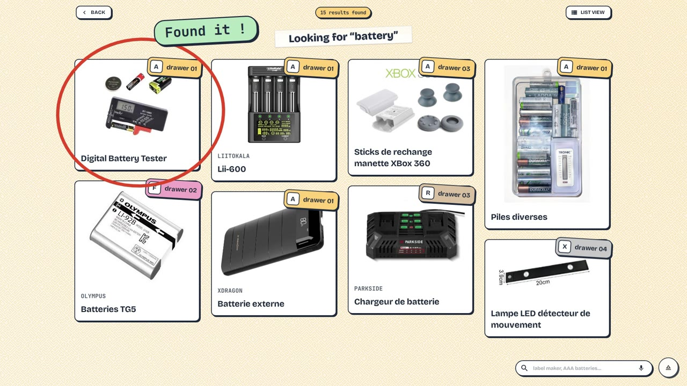

# Stuff Finder

[](https://github.com/Shuunen/stuff-finder/blob/master/LICENSE)
[](https://stuff-finder.netlify.app)



## Demo

[https://stuff-finder.netlify.app](https://stuff-finder.netlify.app)

[](https://stuff-finder.netlify.app)

### How does it work ?

[](docs/brag.mp4)

_Add an item, print its sticky label, then find it from any screen or by scanning its sticker. Source of the video in [brag/](brag/README.md)._

## Features

- Search your stuff by text, voice or barcode/QR scan
- Add, edit, print (labels with QR code) and browse items, in list or grid view
- Offline-first PWA : items are cached in IndexedDB (Dexie) and the app works without network
- Backend on [Appwrite](https://appwrite.io), fuzzy search with [Fuse.js](https://fusejs.io)
- Metrics page to get an overview of your inventory

## Development

```bash
pnpm install
pnpm dev      # start the vite dev server
pnpm check    # types, format, lint, build, unit & e2e tests
```

## Build sizes

- 0.1.1 : 4KB html + 9KB css + 320KB js
- 0.1.0 : 3KB html + 9KB css + 435KB js
- 0.2.0 : 8KB html + 20KB css + 305KB js
- 0.4.0 : 12KB html + 22KB css + 320KB js
- 0.5.0 : 12KB html + 22KB css + 330KB js
- 1.0.0 : 6KB html + 27KB css + 360KB js (migration to vite & preact with old code)
- 1.1.0 : 6KB html + 27KB css + 445KB js (added mui + mui icons)
- 1.2.0 : 3KB html + 26KB css + 622KB js (added notistack + preact-router)
- 1.3.0 : 3KB html + 16KB css + 683KB js
- 2.0.0 : 3KB html + 18KB css + 720KB js (more components, better design)
- 2.1.0 : 1KB html + 18KB css + 726KB js
- 2.2.0 : 1KB html + 18KB css + 691KB js (after making everything lazy & optimizing common deps)
- 3.0.0 : 2KB html + 28KB css + 1007KB js (after react migration and various features)
- 3.1.0 : 3KB html + 31KB css + 1020KB js (new design: AppPill, AppWave, AppLocSticker, AppButton)
- 3.2.3 : 3KB html + 32KB css + 1221KB js (offline-first with dexie & pwa)

Tooling benchmarks are tracked in [docs/benchmarks.md](docs/benchmarks.md).

## Thanks

- [101 Soundboards](https://www.101soundboards.com/sounds/1295599-barcode-scan-beep-09) : for the various sounds used in the app
- [Boxy Svg](https://boxy-svg.com) : simple & effective svg editor
- [Oxlint](https://oxc.rs/docs/guide/usage/linter.html) : super fast linter to find & fix problems
- [Oxfmt](https://oxc.rs/docs/guide/usage/formatter.html) : super fast formatter
- [Appwrite](https://appwrite.io) : open source backend for storing the items
- [Dexie](https://dexie.org) : minimal IndexedDB wrapper for offline-first storage
- [Eye icon](https://www.iconfinder.com/icons/5925640/eye_no_view_icon) by IconPai
- [Favicon.io](https://favicon.io/favicon-generator/?t=SF&ff=Istok+Web&fs=110&fc=%23FFF&b=rounded&bc=%23e04a2b) : handy favicon generator
- [Fuse.js](https://fusejs.io) : lightweight fuzzy search
- [Github](https://github.com) : this great, free and evolving platform
- [MUI](https://mui.com) : a nice material ui lib
- [Netlify](https://netlify.com) : awesome company that offers hosting for OSS
- [Pattern Monster](https://pattern.monster/doodle-21) : Various quality patterns for app bg
- [React](https://reactjs.org) : great library for web and native user interfaces
- [Playwright](https://playwright.dev) : reliable end-to-end testing
- [RIOT Optimizer](https://riot-optimizer.com) : Radical Image Optimization Tool, the best software I found to compress images
- [Shields.io](https://shields.io) : for the nice badges on top of this readme
- [Shuutils](https://github.com/Shuunen/shuutils) : collection of pure JS utils
- [SvgOmg](https://jakearchibald.github.io/svgomg/) : great tool to reduce svg image size
- [TailwindCss](https://tailwindcss.com) : awesome lib to produce maintainable style
- [Turborepo](https://turborepo.dev) : task runner with caching
- [Valibot](https://valibot.dev) : tiny schema validation
- [V8](https://github.com/demurgos/v8-coverage) : simple & effective cli for code coverage
- [Vite](https://github.com/vitejs/vite) : super fast frontend tooling
- [Vite PWA](https://vite-pwa-org.netlify.app) : offline support and installable app
- [Vitest](https://github.com/vitest-dev/vitest) : super fast vite-native testing framework
